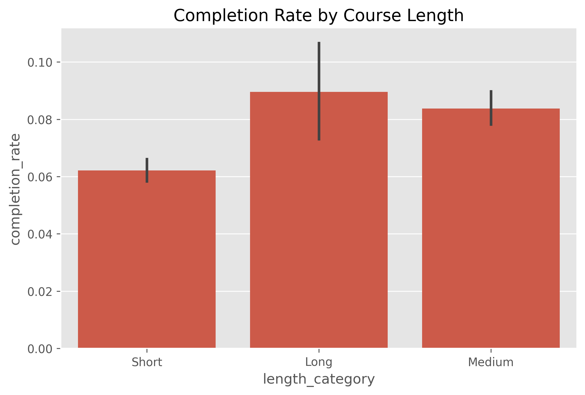
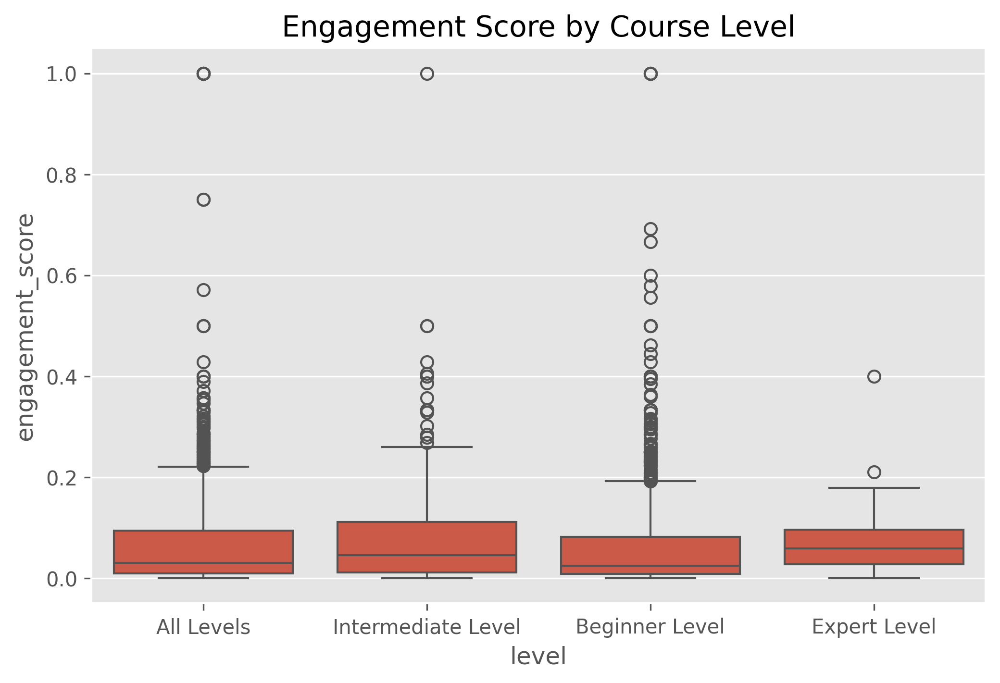
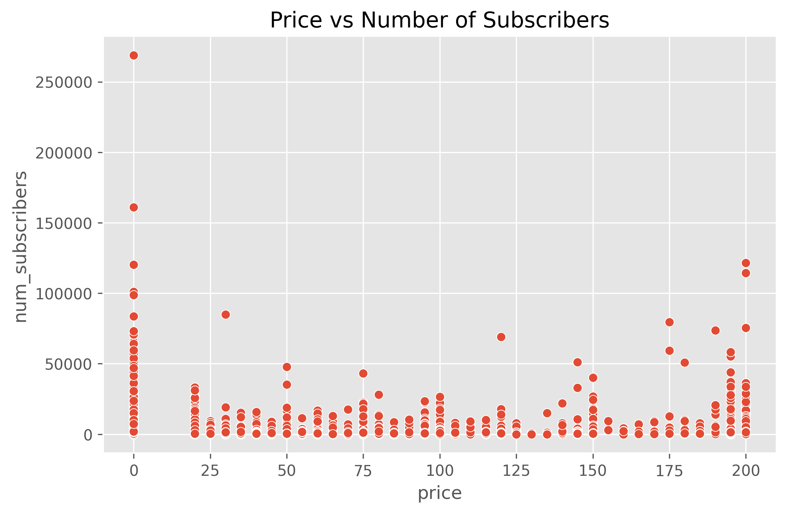
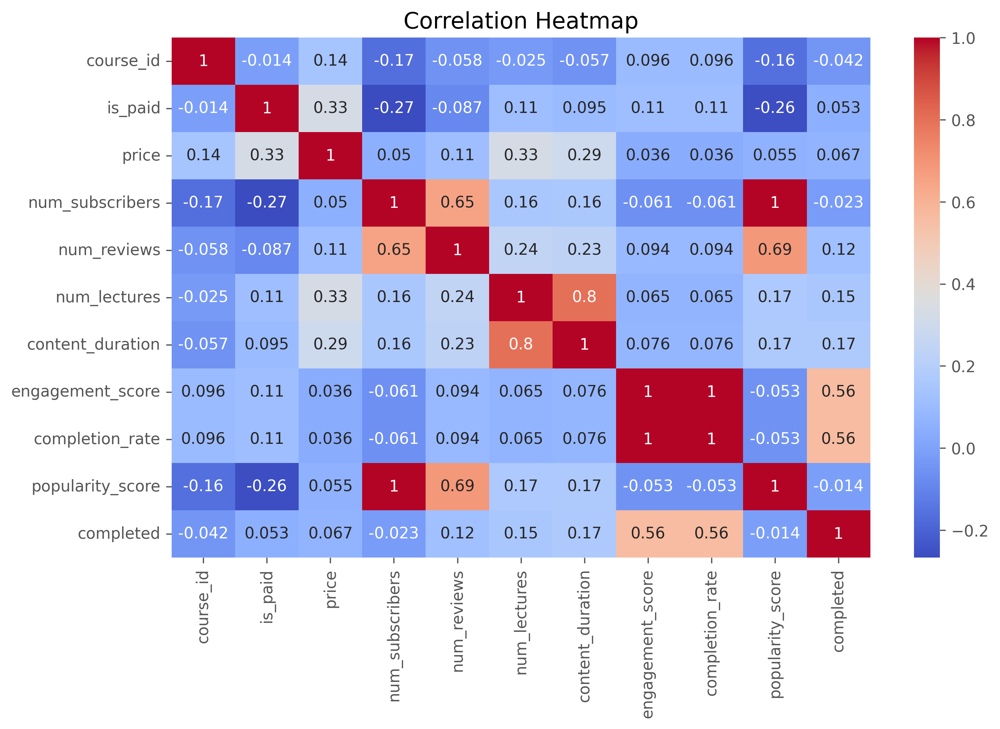
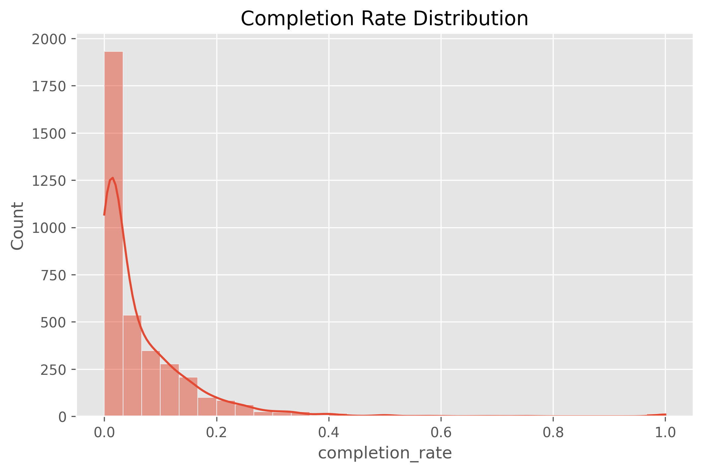

# 📊 Online Learning Behavior Analysis

## 🚀 Overview

This project explores patterns in online learning platforms by analyzing course-level data and simulating learner behavior. The goal is to identify factors that influence course engagement and completion.

---

## 🎯 Problem Statement

Online courses often suffer from low completion rates. This project aims to answer:

* What factors influence course completion?
* Does course length affect engagement?
* How do pricing and difficulty level impact user behavior?

---

## 📂 Dataset

* Source: Udemy Courses Dataset (Kaggle)
* Data includes:

  * Course title, price, subscribers, reviews
  * Content duration, difficulty level

Additional features were engineered to simulate learner behavior.

---

## ⚙️ Methodology

### 🔹 Data Cleaning

* Removed duplicates
* Handled missing values
* Standardized column names

### 🔹 Feature Engineering

* **Engagement Score** = reviews / subscribers
* **Completion Rate (proxy)**
* **Popularity Score**
* **Course Length Category** (Short / Medium / Long)
* **Completion Label** (for modeling)

---

## 📊 Exploratory Data Analysis

### 📌 Completion Rate by Course Length



### 📌 Engagement by Course Level



### 📌 Price vs Subscribers



### 📌 Correlation Heatmap



### 📌 Completion Distribution



---

## 🔍 Key Insights

* 📈 Medium-length courses show higher completion rates compared to very short or long courses
* 🧠 Engagement score is strongly correlated with completion
* 💰 Higher-priced courses tend to have fewer subscribers
* 🎓 Beginner-level courses attract more users but may not guarantee higher engagement
* 📉 Most courses exhibit low completion rates, indicating significant drop-off

---

## 💡 Business Recommendations

* Optimize course length (5–20 hours) for better retention
* Increase engagement through quizzes and interactive content
* Re-evaluate pricing strategies to balance accessibility and value
* Improve course structure to reduce early drop-offs

---

## 🤖 Model (Optional)

A Logistic Regression model was built to predict course completion based on:

* Engagement
* Course length
* Popularity
* Price and level

---

## 🛠️ Tech Stack

* Python (Pandas, NumPy)
* Seaborn, Matplotlib
* Scikit-learn
* Jupyter Notebook

---

## 📁 Project Structure

```
online-learning-behavior-analysis/
├── data/
├── notebooks/
├── src/
├── visuals/
├── reports/
├── README.md
```

---

## ⚠️ Limitations

* Completion rate is estimated using proxy metrics
* Dataset does not contain actual user-level behavior
* Assumptions may not fully reflect real-world engagement

---

## 🔮 Future Improvements

* Use real user interaction datasets
* Build advanced ML models (Random Forest, XGBoost)
* Develop interactive dashboard (Power BI / Tableau)

---

## 👨‍💻 Author

Sivasubramaniyan

---

## ⭐ If you found this useful, consider giving a star!
